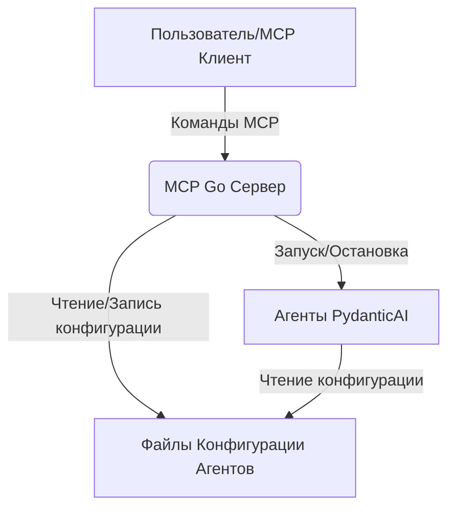

# Системные шаблоны: MCP-сервер для PydanticAI

## Архитектура системы

Система будет состоять из двух основных компонентов:

1.  **MCP-сервер на Go:** Легковесное приложение, отвечающее за:
    *   Прием команд MCP.
    *   Управление жизненным циклом агентов PydanticAI (запуск, остановка).
    *   Чтение и запись конфигурационных файлов агентов.
    *   Предоставление инструментов и ресурсов через MCP.
2.  **Агенты PydanticAI:** Python-приложения, которые выполняют определенные задачи и читают свою конфигурацию из локальных файлов.

## Ключевые технические решения

*   **Go для сервера:** Выбран из-за его производительности, легковесности и простоты развертывания.
*   **JSON для конфигурации:** Конфигурация агентов будет храниться в текстовых файлах, предпочтительно в формате JSON, для удобства чтения и записи как Go-сервером, так и агентами PydanticAI.
*   **Модульный дизайн:** Сервер будет разработан с использованием модульного подхода, что позволит легко добавлять новые функции и поддерживать код.
*   **Минималистичный стиль:** Фокус на функциональности без излишних зависимостей.

## Используемые шаблоны проектирования

*   **Команда (Command Pattern):** Для обработки команд MCP, где каждая команда инкапсулируется в объект.
*   **Наблюдатель (Observer Pattern):** Возможно, для мониторинга состояния агентов (если потребуется более сложный мониторинг).
*   **Фабрика (Factory Pattern):** Для создания экземпляров агентов PydanticAI на основе их конфигурации.
*   **Опции сервера (ServerOption):** Паттерн для конфигурирования сервера при его создании, позволяющий гибко настраивать поведение.

## Взаимосвязи компонентов

*   MCP Go Сервер будет взаимодействовать с агентами PydanticAI через системные вызовы (например, `os/exec` в Go) для их запуска и остановки.
*   Конфигурационные файлы будут служить точкой обмена данными между Go-сервером и агентами PydanticAI.
*   MCP-клиент будет взаимодействовать с Go-сервером по протоколу MCP.

## Критические пути реализации

*   Надежный запуск и остановка агентов PydanticAI.
*   Атомарные операции записи конфигурационных файлов для предотвращения повреждения данных.
*   Обработка ошибок при взаимодействии с агентами и файловой системой.
*   Потокобезопасный доступ к данным о запущенных агентах и их конфигурациях с использованием `sync.RWMutex`.
</content>
